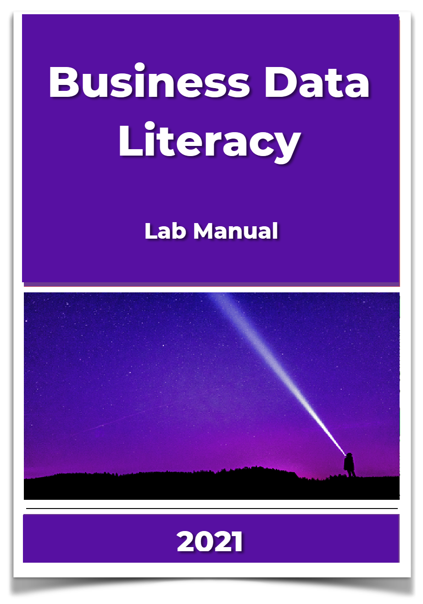

<style type="text/css">
.title {
  display: none;
}

#getting-started img {
  margin-right: 10px;
}

</style>

# Business Data Literacy Course

<div class="row">
<div class="col-sm-6">

Last updated: `r Sys.Date()`

All materials are totally **free and open**, including [textbook](https://crumplab.github.io/statistics/), and [lab manual](https://crumplab.github.io/statisticsLab/).

### Copying/Adopting these materials

This website is written using R Markdown. The source code is here [https://github.com/DrDawnStats/bus_data_lit_course](https://github.com/DrDawnStats/bus_data_lit_course). For anyone interested in adopting these materials, the idea is you can fork the repos for the [website](https://github.com/DrDawnStats/bus_data_lit_course), the [textbook](https://github.com/CrumpLab/statistics), and the [lab manual](https://github.com/CrumpLab/statisticsLab). Then edit as desired for your own purposes. 

</div>
<div class="col-sm-6">

<a href="https://crumplab.github.io/statistics/">
```{r statsTextbook, out.width=200, echo=F}

```
</a>

<a href="https://crumplab.github.io/statisticsLab/">
```{r statsLabManual, out.width=200, echo=F}

```
</a>

</div>
</div>
